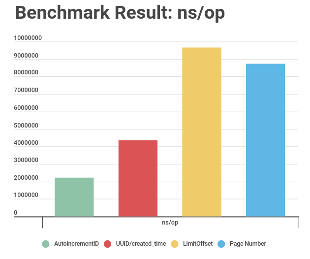

                                                                                           
```sql                                                                                        
SELECT                                                                                        
    *                                                                                         
FROM                                                                                          
    questions                                                                                 
ORDER BY created_time                                                                         
LIMIT 10                                                                                      
OFFSET 20;                                                                                    
```                                                                                           
    - the way of doing this will helps us to ignore offsets                                   
    - not using offset makes the query fast                                                   
                                                                                              
explain analyze select * from questions order by created_at desc offset 10000 limit 10;       
explain analyze select * from events order by id desc limit 10;                               
                                                                                              
```sql                                                                                        
postgres=# explain analyze select * from question order by created_at desc offset 10000000 lim
 Limit  (cost=19.57..19.57 rows=1 width=401) (actual time=0.028..0.029 rows=0 loops=1)        
   ->  Sort  (cost=19.09..19.57 rows=190 width=401) (actual time=0.025..0.026 rows=1 loops=1) 
         Sort Key: created_at DESC                                                            
         Sort Method: quicksort  Memory: 25kB                                                 
         ->  Seq Scan on events  (cost=0.00..11.90 rows=190 width=401) (actual time=0.014..0.0
 Planning Time: 0.165 ms                                                                      
 Execution Time: 0.075 ms                                                                     
```                                                                                           
see if we use offset we can see it will fetch the columns first and then limit it to 10. so th
we are doing this is by using the id ( unique)  as a offset to the value we used before and pa
using this

```sql
postgres=# explain analyze select * from events order by id desc limit 10;
 Limit  (cost=0.14..2.82 rows=10 width=401) (actual time=0.022..0.051 rows=1 loops=1)
   ->  Index Scan Backward using events_pkey on events  (cost=0.14..51.00 rows=190 width=401) 
 Planning Time: 0.145 ms
 Execution Time: 0.087 ms
```
 ---

## Pagination with Page Number

betchmark results

         ```
$ go test --bench=. --benchmem  -v .
goos: darwin
goarch: amd64
pkg: github.com/bxcodec/go-postgres-pagination-example/pagenumber
BenchmarkFetchQuery
BenchmarkFetchQuery-4   	   10000	   8731975 ns/op	    9201 B/op	     221 allocs/op
PASS
         ```

### Pagination with Offset and Limit

         ```
$ go test --bench=. --benchmem  -v .
goos: darwin
goarch: amd64
pkg: github.com/bxcodec/go-postgres-pagination-example/offsetlimit
BenchmarkFetchQuery
BenchmarkFetchQuery-4   	   10000	   9663250 ns/op	    9202 B/op	     221 allocs/op
PASS
ok  	github.com/bxcodec/go-postgres-pagination-example/offsetlimit	96.744s
         ```

### Pagination with Auto Incremental PK of the ID

         ```
$ go test --bench=. --benchmem  -v .
goos: darwin
goarch: amd64
pkg: github.com/bxcodec/go-postgres-pagination-example/autoincrementid
BenchmarkFetchQuery
BenchmarkFetchQuery-4   	   10000	   2220470 ns/op	   10099 B/op	     226 allocs/op
PASS
ok  	github.com/bxcodec/go-postgres-pagination-example/autoincrementid	22.303s

         ```

### Pagination with UUID Combined with Created Timestamp


         ```

$ go test --bench=. --benchmem  -v .
goos: darwin
goarch: amd64
pkg: github.com/bxcodec/go-postgres-pagination-example/uuidcreatedtime
BenchmarkFetchQuery
BenchmarkFetchQuery-4   	   10000	   4354580 ns/op	   12868 B/op	     264 allocs/op
PASS
         ```
---

final results



more information from [here](https://medium.com/easyread/how-to-do-pagination-in-postgres-with-golang-in-4-common-ways-12365b9fb528)
